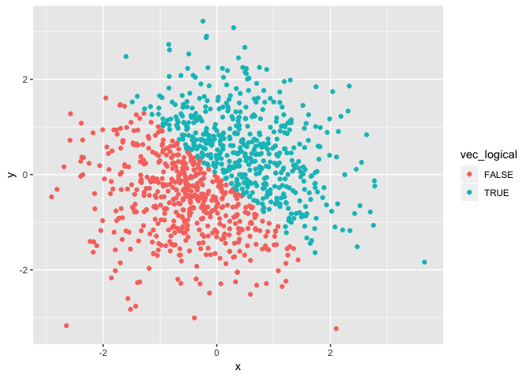
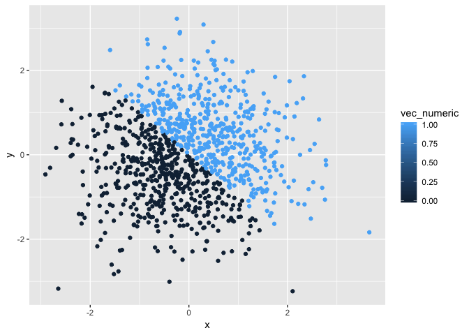
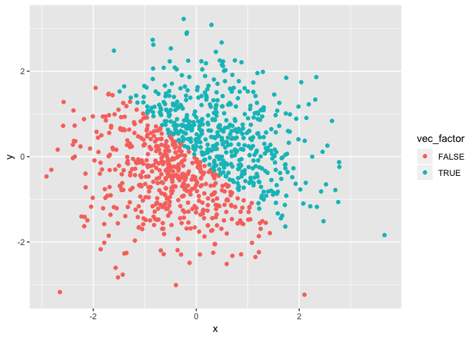

p8105\_hw1\_jx2371
================
Jingyu Xu
2018/9/21

I set a globle option which hides the message and warning information.

``` r
knitr::opts_chunk$set(message = FALSE, warning = FALSE)
```

Problem 1
=========

create a data frame
-------------------

Firstly, a code chunk is created to create a data frame comprised of:
1)A random sample of size 10 from a uniform\[0, 5\] distribution
2)A logical vector indicating whether elements of the sample are greater than 2
3)A (length-10) character vector
4)A (length-10) factor vector

``` r
library(tidyverse)
df_1 = tibble(
vec_rnorm = rnorm(10, mean=0, sd=5),
vec_logical = c(vec_rnorm>2), 
vec_character = c("a", "b", "c", "d", "e", "f", "g", "h", "i", "j"),
vec_factor = factor(c("male", "male", "female", "female", "male", "male", "female", "female", "male", "female"))
 )
```

caculate the mean
-----------------

Then, a code chunck is created to caculate the mean of each variables in the dataframe(df\_1)

``` r
mean(df_1$vec_rnorm)
```

    ## [1] -0.4501068

``` r
mean(df_1$vec_logical)
```

    ## [1] 0.3

``` r
mean(df_1$vec_character)
```

    ## [1] NA

``` r
mean(df_1$vec_factor)
```

    ## [1] NA

From the output, the mean of numeric and logical variables can be caculated, while those of the character and factor ones return to NA.

convert the variables
---------------------

And I write a code chunk that applies the as.numeric function to the logical, character, and factor variables. specially，the output is hided.

``` r
as.numeric(df_1$vec_logical)
as.numeric(df_1$vec_character)
as.numeric(df_1$vec_factor)
```

As for the logical variables, "TRUE" is converted to "1" and "FALSE" is converted to "0". And the character variables are converted to NA. The factor variables are converted to "1" and "2".

Then, convert the character variable from character to factor to numeric.

``` r
as.numeric(as.factor(df_1$vec_character))
```

We can see the 10 different factor variables are converted to continous integers from 1 to 10.

Last, convert the factor variable from factor to character to numeric.

``` r
as.numeric(as.character(df_1$vec_factor))
```

We can see the factor variables are finally converted to NA.

Problem 2
=========

create a data frame
-------------------

Firstly, a code chunk is created to create a data frame comprised of:
x: a random sample of size 1000 from a standard Normal distribution
y: a random sample of size 1000 from a standard Normal distribution
A logical vector indicating whether the x + y &gt; 0
A numeric vector created by coercing the above logical vector
A factor vector created by coercing the above logical vector

``` r
 library(tidyverse)
 df_2 = tibble(
  x = rnorm(1000, mean=0, sd=1),
  y = rnorm(1000, mean=0, sd=1),
  vec_logical = c(x+y>0),
  vec_numeric = as.numeric(vec_logical),
  vec_factor = as.factor(vec_logical)
 )
```

inline R code
-------------

Inline R codes are used to describe the dataframe.
*the size of the dataset* is (1000, 5)
*the mean and median of x * are -0.0274664 and -0.0768193
*the proportion of cases for which the logical vector is TRUE* is 0.501

make the scatterplot
--------------------

A code chunk is created to make a scatterplot of y vs x, with color points using the logical variable.

``` r
pic_1<-ggplot(df_2, aes(x = x, y = y, color=vec_logical)) + geom_point()
pic_1
```



Similarly, code chunks is used to make scatterplot of y vs x, with color points using the numeric variables and the factor variables(scatterplot\_3).

``` r
ggplot(df_2, aes(x = x, y = y, color=vec_numeric)) + geom_point()
```



``` r
ggplot(df_2, aes(x = x, y = y, color=vec_factor)) + geom_point()
```



Viewing the three scatterplots, numeric variables denote different colors from those of logical and factor ones. And the color scale indicates that the frequency of x&gt;y and x&lt;y are nearly the same, because the points are evenly located.

In the end, I use ggsave to export the first scatterplot.

``` r
ggsave(pic_1, file = "scatterplot_1.png")
```
